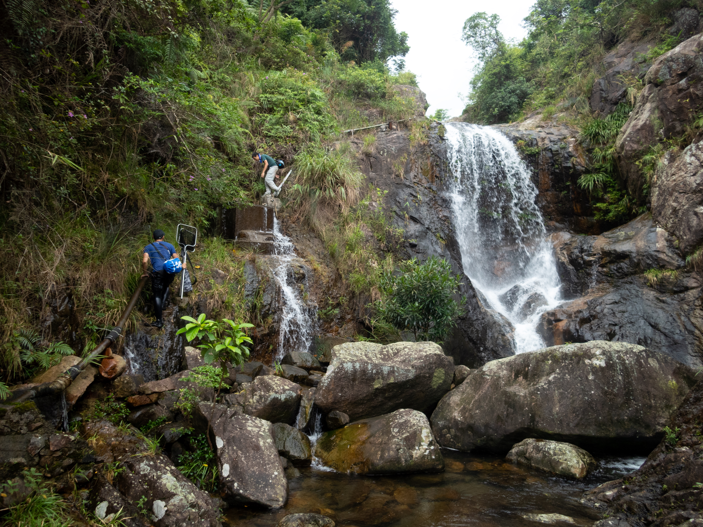
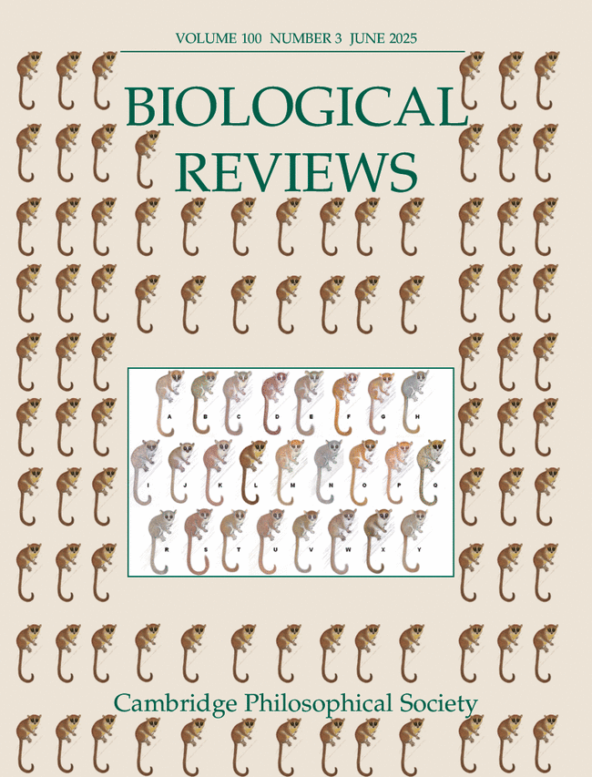
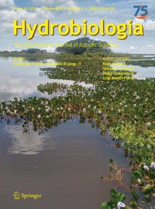
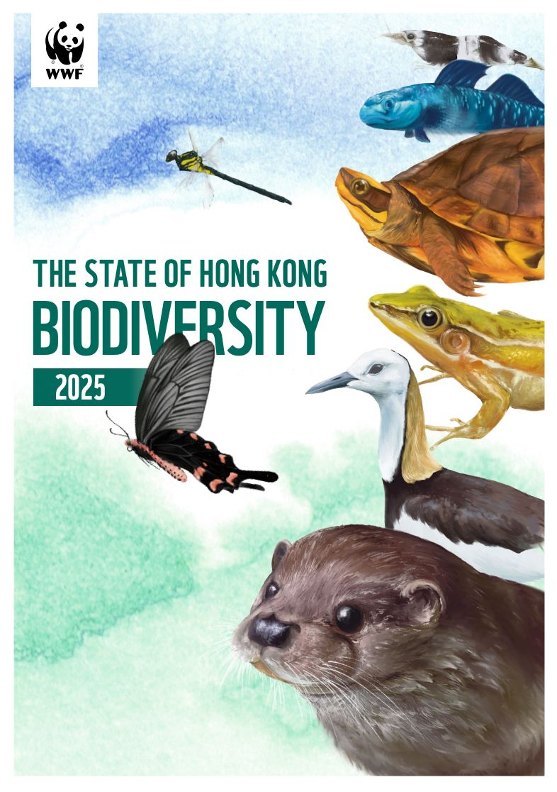

<!-- ::: {.column-screen} -->

<!-- ::: -->

<h2 style="text-align: center;">Thank you for checking out my website, where I strive to *conserve aquatic biodiversity from mountain to sea*</h2>

Using field, modelling, and genetic approaches, I strive to advance the understanding of how global environmental change impacts the marine-freshwater continuum, focusing on highly mobile but imperilled diadromous migrants. I also have a broad interest in natural history and conservation, and continue to be involved in research of freshwater invasions, the wildlife trade, and the systematics of East-Asian minnows and caridean shrimps. A core philosophy is making my work translatable to actionable policy, and I have undertaken regional assessments of conservation statuses for freshwater biodiversity with WWF Hong Kong and advised the Hong Kong Government's Biodiversity Strategy and Action Plan. I also believe there is a misalignment between research and education, and I attempt to bridge this through the conservation organization that I founded, [Freshwater Collective](https://www.freshwatercollective.org).

Read more about me [here](about.qmd).

 

 

## News ##

::: scrolling
**June 2026 » Feature article of my diadromous journey (and TREE article).** Croucher News Team wrote up a brilliant [article](https://croucher.org.hk/en/news/the-tropical-migrants-that-conservation-forgot) on the importance of diadromous migrants, why those in the tropics need our help, and my conservation journey with them. I should use it as a self-introduction from now on! 

**May 2026 » I successfully defended my PhD!** I flew back to Hong Kong for a week-long whirlwind to complete my PhD on May 13th. 

**February 2026 » I'm an incoming Croucher Fellow at UC Berkeley!** After one of the most stressful 24 hours of my life, I'm ecstatic to announce that I was selected to be a Croucher Fellow, where I'll be working with [Albert Ruhí](https://ruhilab.org/) to investigate how extreme events are reshuffling diadromous fishes! I'll be joining Albert at UC Berkeley after my stint at UCSB in October 2026. My interview was hours before my flight to California and I received the news just as my plane took off...

**February 2026 » My US journey begins!** After months of navigating a tricky visa and graduation timing (working before PhD defense) situation, I've finally made it to California to start my Postdoc with [Rafael J.P. Schmitt](https://es.ucsb.edu/people/rafael-jp-schmitt) at UC Santa Barbara! 
:::

 

## Featured work ##

See the full list of my publications [here](publications.qmd).

::: {layout-ncol=4}
[{height=232}](https://www.cell.com/trends/ecology-evolution/fulltext/S0169-5347(26)00048-0)
Conservation of tropical and subtropical marine-freshwater migrants for ecosystem services
 
 Chan et al. (2026)

[{height=232}](https://onlinelibrary.wiley.com/doi/full/10.1111/brv.70032)
Global consequences of dam-induced river fragmentation on diadromous migrants: a systematic review and meta-analysis
 
 Chan et al. (2025)

  
Small dams fragment assemblages of diadromous and freshwater decapods in Hong Kong lowland streams
 
 Chan et al. (2025)

[{height=232}](https://www.wwf.org.hk/en/biodiversity/hkbiodiversity2025/)
The State of Hong Kong Biodiversity 2025. WWF-Hong Kong
 
 Or, C.K.M. & Chan, B.P.L. (Eds.) (2025)

:::
